# Foundations

of data communication networks


---
layout: two-cols-title
columns: is-4
---

:: title ::
# Objectives

:: left ::

1. Reflect on and collect **requirements** that are the basis of our definition of a *network*.

2. Introduce the ideas of **architecture** (layers and protocols) and apply structured problem solving.

3. Define **performance** metrics for how we measure success.

:: right ::


::default::

*Doing that thing Computer Scientists do...*
---
layout: quote
color: sky-light
quotesize: text-m
authorsize: text-s
author: 'Talking Heads'
---

“*How did I get here?*”

---
layout: two-cols-title
columns: is-4
---

:: title ::

# Applications

:: left ::

**The Web**


:: right ::

Based on Hypertext Transfer Protocol (HTTP)

Designed for marked up text, Hypertext Markup Language (HTML)

Includes linking, descriptive formatting, style, images, video, …

Incredibly flexible, often used by higher-level applications


---
layout: two-cols-title
columns: is-4
---

:: title ::

# Applications

:: left ::

The Web

**Email**


:: right ::

The first killer app for the Internet

- Simple Mail Transport Protocol (SMTP)

- Post Office Protocol (POP)

- Internet Message Access Protocol (IMAP)

Now more common to access email via web (HTTP).

---
layout: two-cols-title
columns: is-4
---

:: title ::

# Applications

:: left ::

The Web

Email

**File Storage**

:: right ::

Even before the cloud there was network storage

- Network File System (NFS)

- Common Internet File System (CIFS)

- IP Small Computer System Interconnect (iSCSI)

…and of course, over HTTP these days

---
layout: two-cols-title
columns: is-4
---

:: title ::

# Applications

:: left ::

The Web

Email

File Storage

**Multimedia**

:: right ::

Often hidden behind web browser or media player

Motion Picture Experts Group (MPEG) is most common

- Audio - Layers 1, 2, 3 (mp3)

- Images - JPEG

- Video - MPEG-2, …, MPEG-4

---
layout: two-cols-title
columns: is-4
---

:: title ::

# Applications

:: left ::

The Web

Email

File Storage

Multimedia

**More…**

:: right ::

There are too many other applications to enumerate

- Social Media (facebook, X/twitter, instagram)

- Chat & Teams (discord, slack, ...)

- News (reddit, feedly)

- Document and Spreadsheet editing (Google, Microsoft, …)

- Slide presentations (Google, Microsoft, …)

---
layout: center
---


<div style="text-align: right; width: 100%; font-size: small;">

Source: [Gerald Maduabuchi(Quora), Phillip Webber](https://www.quora.com/What-is-the-technology-stack-for-Facebook)

</div>

---
layout: center
---

# Tech Stacks

In groups of 2-3, Google the "tech stack" for a website or web based application. In your investigation, answer these two questions:

<Question>

# What technologies do they use?
</Question>

<Question>

# Which are _network_ technologies?
</Question>

<CountdownTimer :minutes="5" :seconds="0" />

---
layout: default
---

# Tech Stacks

- What technologies did you find?

- Which ones "cross the network"?

- Were there any you found as *standards* (e.g. `http`)

- Were there any that were *unique* to that website or application?

- What else did you find?

---
layout: two-cols-title
columns: is-4
---

:: title ::
# Objectives

:: left ::

1. Reflect on and collect **requirements** that are the basis of our definition of a *network*.

2. Introduce the ideas of **architecture** (layers and protocols) and apply structured problem solving.

3. Define **performance** metrics for how we measure success.

:: right ::


::default::

## Let's start looking at *requirements* first...

---
layout: center
title: dilbert requirements
---


---
layout: two-cols-title
title: requirements
---

:: title ::

# Requirements

:: left ::


:: right ::

The *requirements* for a network vary based on who is viewing the network.

Some requirements are common across all perspectives.

Some requirements are specific to a perspective; users, developers, or service provider.

---
layout: two-cols
columns: is-7
title: common requirements
---

:: left ::


:: right ::

# Common Requirements

These are basic requirements across all perspectives.

- The network needs to be **connected** and **scaleable**.

- The network needs to be **cost-effective**

- The network needs to **support the services** we want to use.

---
layout: two-cols-title
columns: is-4
title: scalable connectivity
---

:: title ::

# Common Requirements

:: left ::

**Scalable Connectivity**

```mermaid
graph TD
    subgraph network1[network 1]
        nodeA["🖥️<br/>Node A"]<-->routerA(router A)
        nodeB["🖥️<br/>Node B"]<-->routerA(router A)
    end

    routerA(🕋<br/>Node L) <--> routerB(🕋<br/>Node M)

    subgraph network2[network 2]
        routerB<-->nodeX["🖥️<br/>Node X"]
    end
```



<!--

-->
:: right ::

<Definition>

### ***Network***: Two or more **nodes** connected by a physical **link**, or two or more **networks** connected by a node.

</Definition>

- **node** is a device connected to the network.
- **link** is what connects nodes together, the physical connection.

Some other relevant terms; a **host** is a type of node, a **switch** or **router** are internally a node and a link.


---
layout: two-cols-title
columns: is-4
title: cost effective
---

:: title ::

# Common Requirements

:: left ::

Scalable Connectivity

**Cost-effective**


:: right ::

To be **cost-effective** data needs to be **multiplexed** over the links among nodes and networks.

```mermaid { scale: 0.75 }
graph LR
    subgraph network1[network 1]
        nodeA["🖥️<br/>Node A"]<-->routerA(router A)
        nodeB["🖥️<br/>Node B"]<-->routerA(router A)
        nodeC["🖥️<br/>Node C"]<-->routerA(router A)
    end

    routerA(🕋<br/>switch) e1@<===>|multiplexed</br>data|routerB(🕋<br/>switch)
    e1@{ animate: true }

    subgraph network2[network 2]
        routerB<-->nodeX["🖥️<br/>Node X"]
        routerB<-->nodeY["🖥️<br/>Node Y"]
        routerB<-->nodeZ["🖥️<br/>Node Z"]
    end
```


There are a few common ways we can accomplish this.


---
layout: two-cols
columns: is-8
---

:: left ::

# Sharing the Wire
## A Mutiplexing Simulation

Let's play a card game to explore different ways to **multiplex** data over a single link.

Work in groups of 4. Each group gets an **Instruction Sheet** and Game Area and **15 message cards** (3 red, 3 green, 3 orange)

### Setup

- 3 **Senders** take colored cards and write a (less than 5 letter) word, one letter per card in the message data area. Include the position in the word for the letter as the sequence number.
- 1 **Receiver** setup the game board next to them where messages will be delivered.

:: right ::


e.x. Sequence 1="D", 2="o", 3="g"


---
layout: two-cols
columns: is-8
title: sharing the wire - round 1
---

:: left ::

# Sharing the Wire
# Round 1

The **Time Keeper**  (Instructor) will be the system clock. Players can only act when the time keeper says to act and they can only take one action!

- Each sender has their own lane (colored area).
- All senders place one packet in their lane at the same time.
- Receiver collects one packet from each lane, adds the new packets to pile of packets for each sender.

After time ends, the receiver decodes the messages sent by the senders.

:: right ::


---
layout: two-cols
columns: is-8
title: sharing the wire - round 2
---

:: left ::

# Sharing the Wire
# Round 2

The **Time Keeper**  (Instructor) will be the system clock. Senders can only act when the time keeper says to act and they can only take one action!

- All senders share **one lane** (center lane).
- Senders take turns in fixed order placing their next packet.
- Receiver picks up packets one at a time and puts it into their correct received pile.
- If it is a senders turn and they have no more data, the turn is not used, the sender and reciever do nothing.

After time ends, the receiver decodes the messages sent by the senders.

:: right ::


---
layout: two-cols
columns: is-8
title: sharing the wire - round 3
---

:: left ::

# Sharing the Wire
# Round 3

The **Time Keeper**  (Instructor) will be the system clock. Senders can only act when the time keeper says to act and they can only take one action!

- All senders share **one lane** (center lane).
- If there are no packets in the lane, senders place a packet in any order, whoever gets their packet there first wins.
- Receiver picks up packet and puts into their correct received pile.
- If a sender has no more packets to send, they do nothing.

After time ends, the receiver decodes the messages sent by the senders.

:: right ::


---
title: sharing the wire - discussion
---

# Sharing the Wire -- Discussion

<v-clicks depth="2">

- **Round 1** - Frequency Division
    - Each sender has $1/3$ the total **bandwidth** and sends $1/3$ of a packet at a time.
    - Wasted lane when sender has no more data to send. **not efficient**

- **Round 2** - Time Division
    - Each sender has full bandwidth for $1/3$ of the time.
    - Wasted time slots when sender has no more data to send. **not efficient**

- **Round 3** - Packet Switching
    - No wasted lane or time slots
    - Senders collide when sending.
    - Receiver may need to put packets back in order.
</v-clicks>

---
layout: two-cols-title
columns: is-4
title: frequency division
---

:: title ::

# Common Requirements

:: left ::

Scalable Connectivity

**Cost-effective**

:: right ::

## Frequency Division Multiplexing

Each sender gets a unique channel that is $1/n$ the entire band.


The empty boxes above represent when no sender has any more data to send, their frequency band (or lane) goes unused.

This is how broadcast radio and television work. Each station gets a sub-band of the entire band. They broadcast continuiously and thus always have "data" to send.

---
layout: two-cols-title
columns: is-4
title: time division
---

:: title ::

# Common Requirements

:: left ::

Scalable Connectivity

**Cost-effective**

:: right ::

## Time Division Multiplexing

Each sender gets a unique time slot, it goes unused if they have no data to send.


The empty boxes above represent when a sender has no more data to send, their time slot goes unused.

During their time slot they use the *entire band* so can send $3×$ the amount of data during the time slot as with frequency division.

---
layout: two-cols-title
columns: is-4
title: time division compact
---

:: title ::

# Common Requirements

:: left ::

Scalable Connectivity

**Cost-effective**

:: right ::

## Time Division Multiplexing

Each sender gets a unique time slot, it goes unused if they have no data to send.


The empty boxes above represent when a sender has no more data to send, their 
time slot goes unused.

During their time slot they use the *entire band* so can send $3×$ the amount of data during the time slot as with frequency division.

This collapsed version is a bit more compact and easy to look at. Note the "A" instead of "a" to represent $3×$ the data in the packet.


---
layout: two-cols-title
columns: is-4
title: packet switching
---

:: title ::

# Common Requirements

:: left ::

Scalable Connectivity

**Cost-effective**

:: right ::

## Packet Switching

Like **Time Division** senders use the entire band to send data during fixed size time slots. 


With **Packet Switching** senders can send **whenever they have data and the link is idle**.

The empty boxes above represent when **no sender** has data to send. The time slots do not go unused. If there were **any data** from **any sender** they could use those slots to send their data.

As you likely discovered, there can be **collisions** when multiple senders try to send. We will deal with those later.

---
layout: two-cols-title
columns: is-4
title: multiplexing summary
---

:: title ::

# Common Requirements

:: left ::

Scalable Connectivity

**Cost-effective**

:: right ::

## Frequency Division Multiplexing 


## Time Division Multiplexing 


## Packet Switching (most effective)


---
layout: two-cols-title
columns: is-4
title: support common services
---

:: title ::

# Common Requirements

:: left ::

Scalable Connectivity

Cost-effective

**Support Common Services**

:: right ::

The network should support common services.

It needs to define **useful channels** that understand the **application needs** and the **network's ability**.

- File Transfer (upload/download)
- Multimedia Streaming (watch a movie)
- Web Browsing
- Interactive Videoconference
- Data Reporting (e.g. weather conditions)
- Command and Control (e.g. "turn on light")

---
layout: two-cols-title
columns: is-4
title: reliable and manageable
---

:: title ::

# Common Requirements

:: left ::

Scalable Connectivity

Cost-effective

Support Common Services

**Reliable and Manageable**

:: right ::

## Reliable

Fill in the gaps between what an application expects and what the underlying technology can provide.

- Handles interruptions in service and equipment malfunctions

## Manageable

The network can continue to work with new services and parameters.

- Upgrades are easy, Billing is accurate
- Supports new applications

---
layout: two-cols
title: common requirements review
---

:: left ::


:: right ::

# Common Requirements

These are basic requirements across all perspectives.

- The network needs to be **connected** and **scaleable**.

- The network needs to be **cost-effective**

- The network needs to **support the services** we want to use.


---
layout: two-cols
title: user requirements
---

:: left ::


:: right ::

# User Requirements

Users want an inexpensive and fast network that supports the applications they want to use.

- Support common applications; web, video, audio, chat
- Fast for downloads and streaming.
- Inexpensive (or at least cost-efficient)
- Reliable and recovers quickly when failures occur

---
layout: two-cols
title: developer requirements
---

:: left ::


:: right ::

# Developer Requirements

Developers want a network that provides well thought out libraries to develop against that provide the communication channels they need for their applications.

- Easy to use libraries or language constructs
- Secure and security built-in
- Supports common service paradigms; client-server, peer-to-peer
- Has good error handling and retry mechanisims

---
layout: two-cols
title: provider requirements
---

:: left ::


:: right ::

## Service Provider Requirements

Service providers (ISPs) want a future-proof network that has good tools for mangement, accounting, and diagnostics.

- Provides verbose accounting tools for billing and cost recovery.
- Comprehensive management tools to pinpoint problems and recover quickly
- Flexible to make best use of costly physical infrastructure
- Reliable to avoid downtime

---
layout: center
title: missing requirements
---

# Requirements

Take a couple of minutes to think about and write down

<Question>

# What requirements are we missing?

</Question>

<CountdownTimer :minutes="2" :seconds="30" />

---
layout: two-cols
columns: is-7
title: architecture
---

:: left ::


:: right ::

# Architecture

The *architecture* of a network is how we design the network to meet our needs. It's like a blueprint, where we make all the major decisions about how it is organized.

There are two **major architectures** in use today; the **ISO/OSI** model and the **TCP/IP** or Internet model.

They both are described as **layers** that interact with each other via well-defined **protocols**.

---
layout: two-cols-title
columns: is-4
title: architecture layers
---

:: title ::

# Architecture

:: left ::

**Layers**

:: right ::

We view the network as a series of **layers** in a **stack**. Each layer can call functions of the layer below it in the stack and can be called by layers above it in the stack using a well defined **Application Programming Interface (API)**.


This is a simplified view of the layers in a network stack.

---
layout: two-cols-title
columns: is-4
title: architecture protocols
---

:: title ::

# Architecture

:: left ::

Layers

**Protocols**

:: right ::

Layers have a **peer-to-peer** interface with the same layer on another host in the network.

Layers at the same level communicate with each other via data passed between them.

```mermaid { scale: 1.25 }
block-beta
columns 3

  block:A
    columns 1
    block:A1["Host 1"]
        A
    end
    highA["High Level"]
    space
    lowA["Low Level"]
    highA --> lowA
    lowA -- "API" --> highA
  end
    space
  block:B
    columns 1
    block:B1["Host 2"]
        B
    end
    highB["High Level"]
    space
    lowB["Low Level"]
    highB -- "API" --> lowB
    lowB --> highB
  end

lowA -- "Peer-to-peer<br/>Interafce" --> lowB
lowB --> lowA
```
This peer-to-peer interface is called a **Protocol**.


---
layout: two-cols-title
columns: is-4
title: architecture encapsulation
---

:: title ::

# Architecture

:: left ::

Layers

Protocols

**Encapsulation**

:: right ::

For the layers to pass control information between themselves, they **encapsulate** data from higher layers into a sub-field of the data they pass with their peer.

Layers **wrap** data from higher layers with control information and pass that the next lower layer. The data is **unwrapped** by their peer.

```mermaid { scale: 1 }
block-beta
    classDef invisible fill:none,stroke:none

    columns 4
    block:A
        columns 1
        application["Application"]
        space
        process["Process-to-process"]
        space
        host["host-to-host"]

        application --> process
        process --> host
    end
    block:B
        columns 1
        adata["[data]"]
        space
        pdata["[process|data]"]
        space
        space

        class adata,pdata,hdata invisible
    end
    block:C
        columns 1
        application2["Application"]
        space
        process2["Process-to-process"]
        space
        host2["host-to-host"]

         process2 --> application2
        host2 --> process2
    end

    host-- "[host|process|data]" -->host2
```

This peer-to-peer interface is called a **Protocol**.


---
layout: two-cols-title
columns: is-4
title: architecture encapsulation
---

:: title ::

# Architecture

:: left ::

Layers

Protocols

**Encapsulation**

- Multiplexing

:: right ::

When sending data, start a the top of the stack and work downwards.

The application data is passed to the *process-to-process* layer which wraps the data with the destination **process information** as determined by the protocol.

Similarly the **host-to-host** layer will add destination **host** information. Then the data will be sent over the network (by a lower layer).

```mermaid { scale: 1 }
block-beta
    classDef invisible fill:none,stroke:none

    columns 2
    block:A
        columns 1
        application["Application"]
        space
        process["Process-to-process"]
        space
        host["host-to-host"]

        application --> process
        process --> host
    end
    block:B
        columns 1
        adata["[data]"]
        space
        pdata["[process|data]"]
        space
        hdata["[host|process|data]"]

        class adata,pdata,hdata invisible
    end

```

---
layout: two-cols-title
columns: is-4
title: architecture encapsulation multiplex
---

:: title ::

# Architecture

:: left ::

Layers

Protocols

**Encapsulation**

- Multiplexing

:: right ::

This **encapsulation** is what enables **multiplexed data**.

At the lowest layer, the **hardware** layer, the data will be sent on the network medium. It is **multiplexed** there using one of the methods we looked at earlier.

```mermaid { scale: 0.75 }
graph LR
    subgraph network1[network 1]
        nodeA["🖥️<br/>Node A"]<-->routerA(router A)
        nodeB["🖥️<br/>Node B"]<-->routerA(router A)
        nodeC["🖥️<br/>Node C"]<-->routerA(router A)
    end

    routerA(🕋<br/>switch) e1@<===>|multiplexed</br>data|routerB(🕋<br/>switch)
    e1@{ animate: true }

    subgraph network2[network 2]
        routerB<-->nodeX["🖥️<br/>Node X"]
        routerB<-->nodeY["🖥️<br/>Node Y"]
        routerB<-->nodeZ["🖥️<br/>Node Z"]
    end
```

---
layout: two-cols-title
columns: is-4
title: architecture encapsulation demultiplex
---

:: title ::

# Architecture

:: left ::

Layers

Protocols

**Encapsulation**

- Multiplexing
- Demultiplexing

:: right ::

When receiving data, start a the bottom and work upwards.

The **host** field of the *host-to-host* layer indicates which *host* the data is for. If we are the **destination host** then the unwapped data can be passed to the next layer up.


```mermaid { scale: 1 }
block-beta
    classDef invisible fill:none,stroke:none

    columns 2
    block:B
        columns 1
        adata["[data]"]
        space
        pdata["[process|data]"]
        space
        hdata["[host|process|data]"]

        class adata,pdata,hdata invisible
    end
    block:C
        columns 1
        application2["Application"]
        space
        process2["Process-to-process"]
        space
        host2["host-to-host"]

         process2 --> application2
        host2 --> process2
    end
```
The **process** field similarly tells *which process* on the host to deliver the data to.


---
layout: two-cols-title
columns: is-4
title: architecture ISO/OSI model
---

:: title ::

# Architecture

:: left ::

Layers

Protocols

Encapsulation

**Models**

:: right ::

There are two common *layered architectures* in use today.

- *International Standards Organization's Open System Interconnect* or **OSI/ISO** model.

- *Internet* or **TCP/IP** model.

The two are interoperable but their layers do not have a direct correspondence to each other.

<ExamTip>

### These two models will be our focus throughout the course. **You should memorize them**
</ExamTip>

---
layout: two-cols-title
columns: is-4
title: architecture ISO/OSI model
---

:: title ::

# Architecture

:: left ::

Layers

Protocols

Encapsulation

**Models**

- **ISO/OSI Model**

:: right ::


<!-- 
```mermaid
block-beta
    columns 1
    
    Application
    Presentation
    Session
    Transport
    Network
    DataLink["Data Link"]
    Physical
    
    style Application fill:#e1f5fe,stroke:#01579b,stroke-width:2px
    style Presentation fill:#f3e5f5,stroke:#4a148c,stroke-width:2px
    style Session fill:#e8f5e8,stroke:#1b5e20,stroke-width:2px
    style Transport fill:#fff3e0,stroke:#e65100,stroke-width:2px
    style Network fill:#fce4ec,stroke:#880e4f,stroke-width:2px
    style DataLink fill:#f1f8e9,stroke:#33691e,stroke-width:2px
    style Physical fill:#fff8e1,stroke:#ff8f00,stroke-width:2px
```
-->

---
layout: two-cols-title
columns: is-4
title: architecture internet model
---

:: title ::

# Architecture

:: left ::

Layers

Protocols

Encapsulation

**Models**

- ISO/OSI Model
- **Internet Model**

:: right ::

The Internet model has fewer layers and allows calling any of them from any other layer.


It tends to be a more popular architecture for developers dur to its relaxed calling nature.


---
layout: two-cols-title
columns: is-4
title: architecture comparison
---

:: title ::

# Architecture

:: left ::

Layers

Protocols

Encapsulation

**Models**

- ISO/OSI Model
- Internet Model
- **Comparison**

:: right ::

<style>
.two-columns {
  display: grid;
  grid-template-columns: 1fr 1fr;
}

.column {
  padding: 0rem;
}
</style>

<div class="two-columns">
<div class="column">

```mermaid { scale: 0.8 }
block-beta
    columns 4
    
    block:osi:2
        columns 1
        OSI["OSI Model"]:1
        Application1["Application (7)"]
        Presentation["Presentation (6)"]
        Session["Session (5)"]
        Transport1["Transport (4)"]
        Network1["Network (3)"]
        DataLink["Data Link (2)"]
        Physical1["Physical (1)"]
    end
    
    block:tcpip:2
        columns 1
        TCP["Internet Model"]:1
        Application2["Application"]
        space:1
        Transport2["Transport<br/>TCP"]
        Transport3["Transport<br/>UDP & IP"]
        Internet["Internet<br/>IP & Network"]
        NetworkAccess["Network Access"]
        space:1
    end
    
    style OSI fill:#333,color:#fff,stroke:#333,stroke-width:2px
    style TCP fill:#333,color:#fff,stroke:#333,stroke-width:2px
    
    style Application1 fill:#e1f5fe,stroke:#01579b,stroke-width:2px
    style Presentation fill:#f3e5f5,stroke:#4a148c,stroke-width:2px
    style Session fill:#e8f5e8,stroke:#1b5e20,stroke-width:2px
    style Transport1 fill:#fff3e0,stroke:#e65100,stroke-width:2px
    style Network1 fill:#fce4ec,stroke:#880e4f,stroke-width:2px
    style DataLink fill:#f1f8e9,stroke:#33691e,stroke-width:2px
    style Physical1 fill:#fff8e1,stroke:#ff8f00,stroke-width:2px
    
    style Application2 fill:#e1f5fe,stroke:#01579b,stroke-width:2px
    style Transport2 fill:#fff3e0,stroke:#e65100,stroke-width:2px
    style Transport3 fill:#fff3e0,stroke:#e65100,stroke-width:2px
    style Internet fill:#fce4ec,stroke:#880e4f,stroke-width:2px
    style NetworkAccess fill:#f1f8e9,stroke:#33691e,stroke-width:2px
```

</div>
<div class="column">

The layers in the two architectures don't directly correspond, but we can compare them.

The Internet model does not have a *presentation* layer. It is left to the application to handle this function.

OSI *session* layer semantics are handled mostly by TCP in the Internet model.

The Internet model's *IP* layer handles functions from the OSI's transport and network layers.

The Internet model *network* layer performs the functions on the OSI network, data-link, and physical layers.

</div>
</div>


---
layout: two-cols
columns: is-7
title: performance
---

:: left ::

```mermaid  {scale: .7}
flowchart LR
    classDef invisible fill:none,stroke:none
    classDef stroked stroke:#f66,stroke-width:2px,color:#fff,stroke-dasharray: 5 5

    A(Foundations)
    A-->B(Reqirements)
    A-->C(Architecture)
    A==>D(**Performance**)

    subgraph sgD[&nbsp;]
        D==>bandwidth
        D==>latency
        D==>D3["bandwidth<br/>x<br/>latency"]
    end
    subgraph sgC[Architecture]
        C
    end
    subgraph sgB[&nbsp;]
        D
    end

    class sgC,sgB invisible
    class sgD stroked
```

:: right ::

# Performance

You may have heard the terms **bandwidth** and **latency** to determine network perofmance.

In this section we will formally define them and see how to measure the performance and the capacity of a network.

This will help us understand not only how to benchmark network performance, but also the factors that can be tuned to affect that performance.

---
layout: two-cols-title
columns: is-4
title: performance bandwitdh
---

:: title ::

# Performance

:: left ::

**Bandwidth**

:: right ::

**Bandwidth** is used to express the number of bits that can be transmitted over the network in a certain period of time, also called the **data rate** or **throughput**.

While this is true, **bandwidth** is actually the *width of the frequency band* data is transmitted over. A **wide** allows for more data to be transmitted during the same preiod of time.


---
layout: two-cols-title
columns: is-4
title: performance bandwitdh example
---
:: title ::

# Performance

:: left ::

**Bandwidth**

:: right ::

Consider these example **bandwidth** calculations:

- On a **10 Mbps** (mega bits per second) link

    - data is transmitted at **10 million bits per second**
    - each bit takes **0.1 μS** to transmit

- On a **20 Mpbs** link, each bit takes **0.05 μs**.

- On a **100 Mpbs** link, each bit takes **0.01 μs**.

<Question>

#### How long does it take to transmit a single bit on a on a **1 Gbps** link?
</Question>

<v-click>

- On a **100 Mpbs** link, each bit takes **0.01 μs**.
</v-click>

---
layout: two-cols-title
columns: is-4
title: performance latency
---

:: title ::

# Performance

:: left ::

Bandwidth

**Latency**

:: right ::

**Latency** is a meausre of the **time** that it takes a message to travel from one node to another. It's also called **delay**. We consider *latency* with the following equations:

<EquationBox>

$$
\begin{align*}
\textbf{latency}        &= \text{propogation} + \text{transmission} + \text{queueing delay} \\
\textbf{popogation}     &= \text{distance} / \text{speed of light} \\
\textbf{transmission}   &= \text{size} / \text{bandwidth}
\end{align*}
$$
</EquationBox>

- **distance** is the length of the medium.
- **speed of light** is the effective speed of light.
- **size** is the size of the data.
- **bandwidth** is the data rate of the transmitted data.
- **queuing delay** is the delay introduced by system components.

---
layout: two-cols-title
columns: is-4
title: performance latency speed of light
---

:: title ::

# Performance

:: left ::

Bandwidth

**Latency**

- Speed of Light

:: right ::

Light travels across different mediums at different speeds!

| **Medium** | **Speed of Light** |
| --- | --- |
| Vacuum | $3.0 \times 10^{8} m/s$ |
| Copper | $2.3 \times 10^{8} m/s$ |
| Fiber | $2.0 \times 10^{8} m/s$ |

These are approximate speeds to give an idea of the differences.

<Note>

Don't worry, the speed of light is still constant, just constant on different mediums.
</Note>

---
layout: two-cols-title
columns: is-4
title: performance latency typical
---

:: title ::

# Performance

:: left ::

Bandwidth

**Latency**
- Speed of Light
- Typical Latency

:: right ::

Latency is usually measured in the **Round Trip Time (RTT)** for data to traverse the network. This is the time to go to a remote node and return to the sender. Hence, *round trip*.

| **Link Type** | **Bandwidth** | **One-way Distance** | **RTT** |
| --- | --- | --- | --- |
| Ethernet LAN | 1 Gbps | 50 m | 0.25 μs |
| Wireless LAN | 54 Mbps | 50 m | 0.33 μs |
| Satellite    | 1 Gbps  | 35,000 km | 230 ms |
| Cross-country fiber | 10 Gbps | 4,000 km | 40 ms |

These are approximate times to give an idea of the differences, your measurements may vary.

---
layout: two-cols-title
columns: is-4
title: performance problem 1
---

:: title ::

# Performance

:: left ::

Bandwidth

Latency

**Bandwidth & Latency**

:: right ::

### Consider a **1 byte message** and a **1 byte response** over a **10 Mbps** link with a **10 ms RTT**.

<Question>

## Does **bandwitdh** or **latency** dominate the total transmission time?
</Question>

<v-click>

**Latency** will dominate the transmission time. Each single-byte transmission will take 10 ms.
</v-click>

<Question v-click="2">

## When will **bandwidth** dominate?
</Question>

<div v-click="3">

When the message size becomes large and takes more than 10&nbsp;ms to transmit.
</div>


---
layout: two-cols-title
columns: is-4
title: performance bandwidth x latency
---
:: title ::

# Performance

:: left ::

Bandwidth

Latency

Bandwidth & Latency

**Bandwidth $\times$ Latency**

:: right ::

Consider a **10 Mbps** link with a **100 ms RTT**.

A **10 KB message** ($10 KB = 10,000 \times 8 = 80,000$ bits).<br/>Will take **8 ms** to transmit.

Because the one-way latency is 50 ms, the data will finish sending before the first bit is received on the other end.

The data is completely **on the network** or **in-flight** during that time!

---
layout: two-cols-title
columns: is-4
title: performance bandwidth x latency question
---
:: title ::

# Performance

:: left ::

Bandwidth

Latency

Bandwidth & Latency

**Bandwidth $\times$ Latency**

:: right ::

Consider a **10 Mbps** link with a **100 ms RTT**.

The data is completely **on the network** or **in-flight** during that time!

<Question>

## How much data can be **in-flight** at a time on the network?
</Question>

<v-click>

$$
\begin{align*}
& \textbf{bandwidth} \times \textbf{latency} = 10\ \text{Mbps} \times 50\ \text{ms}\\
& (10 x 10^{6})\ \text{bits/second} \times (50 x 10^{-3})\ \text{seconds} \\
& 500 \times 10^{3} = 500 Kb = \textbf{\underline{62.5 KB}}
\end{align*}
$$

### ==**62.5 KB** of data can be **on the network**==

The project [pingfs](https://github.com/yarrick/pingfs) actually makes use of this to store files "on the network" without using any local storage.

</v-click>

---
layout: two-cols-title
columns: is-4
title: performance exercise intro
---

:: title ::

# Performance

:: left ::

Bandwidth

Latency

Bandwidth & Latency

Bandwidth $\times$ Latency

**Exercise**

:: right ::

Lets look at some examples in a few different scenarios.

Calcluate the total time required to transfer a **1000 KB file** in the following cases, assuming an **RTT of 50 ms**, a packet size of **1 KB** data, and an **initial 2 $\times$ RTT of "handshaking"** before data is sent.

1. Data can be sent continuiously.
2. The sender needs to wait 1 RTT between packets.
3. The sender can send 20 packets per RTT on an infinite-bandwidth link.
4. The sender can send 1, 2, 4, ... packets on the same infinite-bandwidth link.

<Note>

1KB is $2^{10} = 1,024$ not $10^{3} = 1,000$
</Note>

---
layout: two-cols-title
columns: is-4
title: performance exercise
hide: true
---

:: title ::

# Performance

:: left ::

Bandwidth

Latency

Bandwidth & Latency

Bandwidth $\times$ Latency

**Exercise**

:: right ::

Calcluate the total time required to transfer a **1000 KB file** in the following cases, assuming an **RTT of 50 ms**, a packet size of **1 KB** data, and an **initial 2 $\times$ RTT of "handshaking"** before data is sent.

1. The bandwidth is **10 Mbps**, and data packets can be **sent continuosly**.

2. The bandwidth is **10 Mbps**, but after we finish sending each data packet **we must wait one RTT** before sending the next.

3. The link allows infinitely fast transmit, but limits bandwidth such that only **20 packets can be sent per RTT**.

4. **Zero transmit time**, but during the first RTT we can send one packet, during the second RTT we can sent two packets, during the third we can send four ($2^{3-1}$), etc. (A justification for such an exponential increase will be given later.)

---
layout: two-cols-title
columns: is-4
title: performance exercise a
---

:: title ::

# Performance

:: left ::

Bandwidth

Latency

Bandwidth & Latency

Bandwidth $\times$ Latency

**Exercise**

:: right ::

1. The bandwidth is **10 Mbps**, and data packets can be **sent continuosly**.

$$
\begin{align*}
\text{Handshake}            &= 2 \times RTT                     &&= 0.1\ \text{s} \\
\text{Propagation delay}    &= \text{RTT} / 2                   &&= 0.025\ \text{s}\\
\text{Packet size}          &= 2^{10} \times 8                  &&= 8,192\ \text{bits} \\
\text{Data size}            &= (1,000 \times 2^{10}) \times 8   &&= 8,192,000\ \text{bits} \\
\text{Bandwidth}            &= 1.5 \times 10^{6}                &&= 10\ \text{Mpbs} \\
\text{Transmit time}        &= \text{size} / \text{bandwidth}               \\
                            &= 8,192,000 / (1.5\times 10^{6})  &&= 5.4613\ \text{s}
\end{align*}
$$

$$
\begin{align*}
\text{Handshake} + \text{Propogation\ delay} + \text{Transmit} &= \\
0.1 \ \text{s} + 0.025\ \text{s} + 5.4613\ \text{s} &= \textbf{\underline{5.5863\ \text{s}}}
\end{align*}
$$

---
layout: two-cols-title
columns: is-4
title: performance exercise b
---

:: title ::

# Performance

:: left ::

Bandwidth

Latency

Bandwidth & Latency

Bandwidth $\times$ Latency

**Exercise**

:: right ::

2. The bandwidth is **10 Mbps**, but after we finish sending each data packet **we must wait one RTT** ($0.05\ \text{s}$) before sending the next.

$$
\begin{align*}
\text{Transmit time}        &= 8,192,000 / (1.5\times 10^{6})   &&= 5.4613\ \text{s} \\

\text{Packet size}          &= 2^{10} \times 8                  &&= 8,192\ \text{bits} \\
\text{Data size}            &= (1,000 \times 2^{10}) \times 8   &&= 8,192,000\ \text{bits} \\
\text{Packets}      &= \text{Data size} / \text{Packet size}    &&= 1,000\ \text{packets}\\
\\
\text{Wait time}    &= (\text{Packets} - 1) \times \text{RTT}   &&= 49.95\ \text{s} \\
\text{Transmit}     &= \text{Transmit time} + \text{Wait time}  &&= 55.4113\ \text{s} \\
                    &= 5.4613\ \text{s} + 49.95\ \text{s}       &&= 55.4113\ \text{s}
\end{align*}
$$

$$
\begin{align*}
\text{Handshake} + \text{Propogation\ delay} + \text{Transmit}   &= \\
0.1 \ \text{s}   + 0.025\ \text{s}           + 5.4613\ \text{s}  &= \textbf{\underline{55.5363\ \text{s}}}
\end{align*}
$$

---
layout: two-cols-title
columns: is-4
title: performance exercise c
---

:: title ::

# Performance

:: left ::

Bandwidth

Latency

Bandwidth & Latency

Bandwidth $\times$ Latency

**Exercise**

:: right ::

3. The link allows infinitely fast transmit, but limits bandwidth such that only **20 packets can be setnt per RTT**.

$$
\begin{align*}
\text{Packets}              &= \text{Data size} / \text{Packet size}    &&= 1,000\ \text{packets} \\
\text{Chunks}               &= ceil(\text{Packets} / 20)                &&= 50 \\
\text{RTT}                  &=                                          &&= 0.05\ \text{s} \\
\text{Transmit}             &= \text{Chunks}\times\text{RTT}            &&= 2.6\ \text{s} \\
\text{One-way Propogation}  &= \text{RTT} / 4                           &&= 0.025\ \text{s} \\
\end{align*}
$$

$$
\begin{align*}
\text{Handshake} + \text{Transmit} - \text{One-way Propogation}   &= \\
0.1 \ \text{s}   + 2.6\ \text{s}           - 0.025\ \text{s}  &= \textbf{\underline{2.575\ \text{s}}}
\end{align*}
$$

We subtract One-way Propogation as we don't need to wait after the last chunk is sent.

---
layout: two-cols-title
columns: is-4
title: performance exercise d
---

:: title ::

# Performance

:: left ::

Bandwidth

Latency

Bandwidth & Latency

Bandwidth $\times$ Latency

**Exercise**

:: right ::

4. **Zero transmit time**, as in (3) but during the first RTT we can send one packet, during the second RTT we can sent two packets, during the third we can send four ($2^{3-1}$), etc. (A justification for such an exponential increase will be given later.)

$$
\begin{align*}
\text{Packets}              &= \text{Data size} / \text{Packet size}    &&= 1,000\ \text{packets} \\
\text{Chunks}               &= ceil(log_2(\text{Packets}))              &&= 10 \\
\text{RTT}                  &=                                          &&= 0.05\ \text{s} \\
\text{Transmit}             &= \text{Chunks}\times\text{RTT}            &&= 0.5\ \text{s} \\
\text{One-way Propogation}  &= \text{RTT} / 4                           &&= 0.025\ \text{s} \\
\end{align*}
$$

$$
\begin{align*}
\text{Handshake} + \text{Transmit} - \text{One-way Propogation}   &= \\
0.1 \ \text{s}   + 0.5\ \text{s}           - 0.025\ \text{s}  &= \textbf{\underline{0.575\ \text{s}}}
\end{align*}
$$

---
layout: two-cols-title
columns: is-4
title: performance exercise 2
---

:: title ::

# Performance

:: left ::

Bandwidth

Latency

Bandwidth & Latency

Bandwidth $\times$ Latency

Exercise

**Exercise<br/>On your own**

:: right ::

This exercise is very similar to the previous one, but uses a different **RTT**. Work on this one on your own for practice.

Calcluate the total time required to transfer a **1.5 MB file** in the following cases, assuming an **RTT of 80 ms**, a packet size of **1 KB** data, and an **initial 2 $\times$ RTT of "handshaking"** before data is sent.

1. The bandwidth is **10 Mbps**, and data packets can be **sent continuosly**. (1.458 s)

2. The bandwidth is **10 Mbps**, but after we finish sending each data packet **we must wait one RTT** before sending the next. (124.258 s)

3. The link allows infinitely fast transmit, but limits bandwidth such that only **20 packets can be sent per RTT**. (6.32 s)

4. **Zero transmit time**, but during the first RTT we can send one packet, during the second RTT we can sent two packets, during the third we can send four ($2^{3-1}$), etc. (1 s)


---
layout: center
---

```mermaid  {scale: .75}
flowchart LR
    A(Foundations)
    style A font-size: 150%;
    A==>B(Reqirements)
    B-->B1@{ shape: comment, label: "what does a network need to be a useful network." }
    A==>C(Architecture)
    C-->C1@{ shape: comment, label: "how we design to meet all the requirements." }
    A==>D(Performance)
    D-->D1@{ shape: comment, label: "how we benchmark how well the network works" }    
```