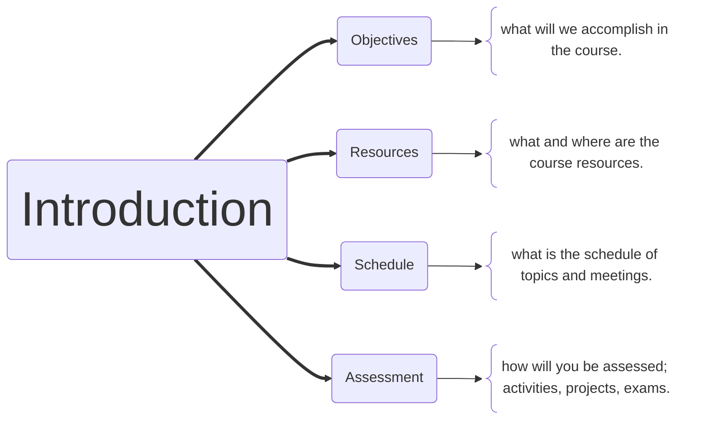

# Computer Networks
## COS 460 / 540 

University of Southern Maine

Stephen Houser <houser@maine.edu>

---
layout: two-cols-title
columns: is-5
---

:: title ::
# About the Course...

:: left ::
Let's take a quick run-through of the course mechanics.

- Course Objectives
- Resources and Textbook
- Schedule
- Projects, activities, and Exams

:: right ::

---

# About Me

- **Why Networks**: 🖥️ I’ve studied and taught data communications for a reasonably long period of time and still find it fun and interesting. My graduate work was performance analysis of network file servers.
- **Courses**: 🧑‍🏫 Operating Systems, System Programming, Mobile Development, Robotics, Art and Craft of Writing Code,
- **Other Interests**: 🧰 general software development and technology, electronics, physical computing, wood and metal working, making things.
- **Fun Fact**: 🎄 For the past few years I've been completing the [Advent of Code](https://adventofcode.com) in December. If you have not tried it, it will surely give you practice writing code!
- **Call me**: 📛 Professor Houser works.
- **Contact**: 📧 Stephen Houser \<houser@maine.edu\>

<Admonition title="Info" color='yellow-light' width="300px" v-drag="[560,400,390,110]">
🏢 I don’t have a permanent office on-campus. 
I will post office-hours availability in the next week.

📷 Zoom is an option, if it works for you!
</Admonition>

---
layout: two-cols-title
columns: is-4
---

:: title ::

# Course Objectives

:: left ::

**What is a network?**

:: right ::

The basics of computer networks and networking.

- Computer networks as a **layered architecture**
- **OSI/ISO Model** of computer networks
- **TCP/IP** Model of computer networks

---
layout: two-cols-title
columns: is-4
---

:: title ::

# Course Objectives

:: left ::

What is a network?

**Connecting Networks**

:: right ::

How networks are connected together to send data from host to host.

- Layers are fun 🍰
- Switching and Bridging
- Routers and Routing
- End to End Data communication

---
layout: two-cols-title
columns: is-4
---

:: title ::

# Course Objectives

:: left ::

What is a network?

Connecting Networks

**Network Applications**

:: right ::

Applications that run over the network and what their data looks like.

- The hardware and software that makes the network work
- Presentation of data to applications
- Multimedia Data (audio, video, other...)
- Encryption, privacy, and security

---
layout: two-cols-title
columns: is-4
---

:: title ::

# Course Objectives

:: left ::

What is a network?

Connecting Networks

Network Applications

**Writing Code**

:: right ::

Writing code for network applications, servers, and services.

- What is a **protocol**
- Client-server applications
- Peer to Peer applications
- Distributed services
- Low and high level libraries

---
layout: quote
color: sky-light
quotesize: text-m
authorsize: text-s
author: 'Neil Gaiman'
---

“*Fairy tales are more than true: not because they tell us that dragons exist, but because they tell us that dragons can be eaten*”

---

# Course Resources

We will be using two primary systems during the semester.

## Brightspace

Slides, activities, exams, reading materials, grades...
Always start from the Brightspace course.

The content is organized into *weekly* modules.

## GitHub / GitHub Classroom

Project submission and tracking. You will need a [GitHub](https://github.com) account.

<Note>

Projects always ==Start== in Brightspace. You will *push* your code to GitHub upon completion.
</Note>

---
layout: two-cols-title
columns: is-7
title: Textbook
---

:: left ::
# Textbook

The textbook for the course is ==FREE== online.

## Computer Networks
## A Systems Approach

Petersen & Davie (5th Edition or newer)

## The book is ==FREE== online

## http://book.systemsapproach.org

==FREE== ==FREE== ==FREE== ==FREE== ==FREE== ==FREE== ==FREE==

:: right ::

---
layout: two-cols-title
columns: is-7
---

:: title ::

# Scheudule

:: left ::

This is roughly the order and time we will spend on the different sections of the course.

- Foundation & Direct Networks (~4 weeks)
- Inter-networks & End-to-End Data (~6 weeks)
- Data & Applications (~5 weeks)

:: right ::

| 🕥 | Typical Class Meeting | |
| :---:  | --- | --- |
| 5:30pm | Lecture and Discussion | |
| 6:15pm | Break | |
| 6:30pm | Lecture and Discussion | |
| 7:15pm | Break | |
| 7:30pm | Project & Activity Time | |

:: default ::

<Note>

Subject to change as the semester progresses. Brightspace will have the definitive dates and topics.
</Note>

---
layout: two-cols-title
columns: is-4
---

:: title ::

# Projects, Activities, and Exams

:: left ::

**Projects**

:: right ::

## 4 programming assignments

- Choose your own language
- Progressively more difficult
- Project 3 and 4 is a two part project we will design in class
- Writing code for network applications, servers, and services.

# ==50 + 100 + 75 + 100 = 325 points==

---
layout: two-cols-title
columns: is-4
---

:: title ::

# Projects, Activities, and Exams

:: left ::

Projects

**Activities**

:: right ::

## In-class Activities

- Discussion
- Quiz
- Worksheet

Will require either submission or discussion in Brightspace.
Often from sections in the textbook or linked topical readings (articles)
Be prepared to work on and discuss in class, you will get called on!

# ==10 $\times$ 15 weeks = 150 points==

---
layout: two-cols-title
columns: is-4
---

:: title ::

# Projects, Activities, and Exams

:: left ::

Projects

Activities

**Exams**

:: right ::

## 3 Exams in Brightspace

- Based on three sections of the course
- Final exam is *comprehensive*
    * ~20% points from prior course material

# ==100 + 100 + 125 = 325 points==

---
layout: two-cols-title
columns: is-4
---

:: title ::

# Projects, Activities, and Exams

:: left ::

Projects

Activities

Exams

**Grade**

:: right ::

Final course grades thus consist of the following maximums:

| Projects   | 325 points |
| --- | --- |
| Activities | 150 points |
| Exams      | 325 points |
|           |     |
| Total      | ==800 points== |

Grades are not scaled. 90-100% is an **A**, 80-89% is a **B**, etc.. The exact point breakdown is detailed in the syllablus in **Birghtspace**.

---

# Questions

<Question>

## Are course meetings optional
</Question>

No. I'm expecting you to be here to take part in the activities with your classmates.

<Question>

## Can I hand in activities or projects late?
</Question>

No. You are expected to complete them on time.

<Question>

## Do I need to buy the textbook?
</Question>

No. It is available ==FREE== online at [http://book.systemsapproach.org](http://book.systemsapproach.org)

## What are your questions?

--- 
layout: center
---

