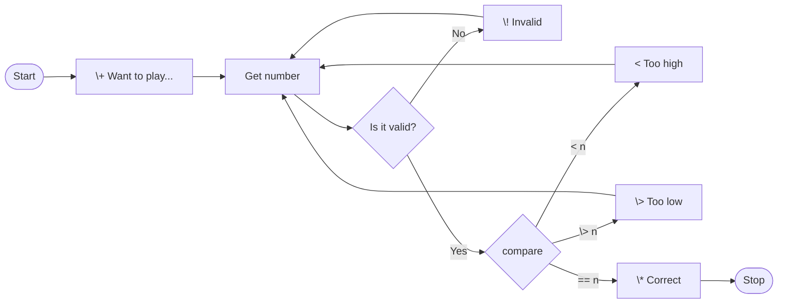
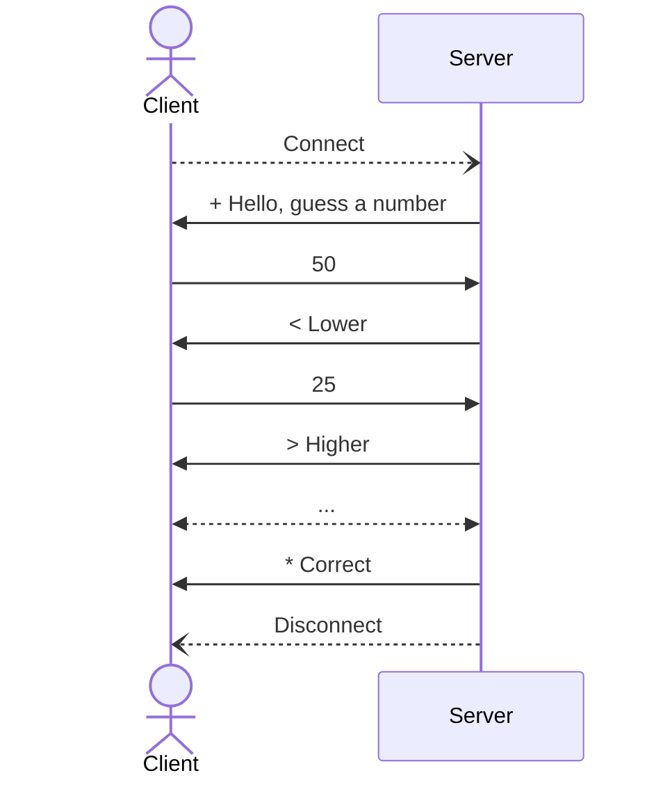

# Project 1 - A Guessing Game

an introduction to network servers
---
layout: side-title
---
:: title ::

## I've chosen a number<br/>between 1 and 100.

## Can you guess it?

:: content ::

# The Goal

In this project you develop a TCP/IP based server that implements a number guessing game. This assignment is an introduction to TCP/IP socket programming and connecting clients and servers together. 

You will only be responsible for the **server** side of things, you will use the `telnet` program for testing and validation.

## The Game

The game is to guess a number between 1 and 100. After a client connects, the server will silently choose a random number and give higher/lower hints to the player as they try to guess the chosen number.

---
layout: default
---

# With a Partner, Play a Few Rounds of the Guessing Game

<Question>

# Write down the sequence of play

- ## How do you start?
- ## What do you do if they give a bad response?
- ## How do you end?
</Question>

<CountdownTimer :minutes="7" :seconds="0" />

---
layout: center
---

# Guessing Game Flow



---
layout: two-cols-title
---

:: title ::

# The Guessing Game Protocol

:: left ::



:: right ::

- **Connect** and **Disconnect** are functions of the TCP/IP socket library shown for clarity.
- The **first character** of each line the server sends are **important**. You can use any text after those.
    - `+ ` indicates the `hello` message.
    - `! ` indicates invalid number was received.
    - `* ` indicates the correct number was guessed. The connection will be terminated.
    - `< ` indicates the guess was too high, the number is lower.
    - `> ` indicates the guess was too low, the number is higher.

---
layout: two-cols-title
columns: is-3
---
:: title ::

# Guessing Game Server

:: left ::

**Requirements**

:: right ::

## The server **must**:

- Accept network connections on a configurable port number (>1024)
- Send the `welcome` message at the start of the communication.
- Read a line of data (terminated by newline).
- If the input is not a number or not [1, 100], send the `invalid` message. Otherwise, send either the `higher`, `lower`, or `correct` message.
- Loop until a correct guess or the connection terminates.

---
layout: two-cols-title
columns: is-3
---

:: title ::

# Guessing Game Server

:: left ::

Requirements

**Non-Requirements**

:: right ::

## The server **must not**:

- Accept guesses via the terminal or shell where it was started.

- Display a graphical interface. This is a **server**. Servers run in the background and have **no user interface**.

- Terminate unexpectedly on invalid input or sudden connection loss. It should be reasonably resillient.

## ==All interaction is over the network==

- If you need diagnostics, you **may** print them to `stdout` of the server program.

---
layout: two-cols-title
columns: is-3
---

:: title ::

# Guessing Game Server

:: left ::

Requirements

Non-Requirements

**Your Code**

:: right ::

## The Programming Part

- Use any programming language you want; Java, Python, C, Go, Rust...

- Use the **socket** library, do not use a higher-level library.

- You should be using functions like `accept()`, `send()`, `receive()`, `read()`, `write()`.

- You only have to handle one connection (client) at a time.

- If you are able to handle multiple clients at once, you will be ready for Project 2. This typically requires multi-threading of some sort.

---
layout: two-cols-title
columns: is-3
title: game code java
---

:: title ::

# Guessing Game Server

:: left ::

Requirements

Non-Requirements

Your Code

- **Java**

:: right ::

## Java

An excellent starting place for **Java** is the [Java Tutorial](https://docs.oracle.com/javase/tutorial). Which includes a lesson [All About Sockets](https://docs.oracle.com/javase/tutorial/networking/sockets/). This example is from that tutorial.

```java {all|2|3|4-7|10|11|12-13|11|all}{ lines: true }
try ( 
    ServerSocket serverSocket = new ServerSocket(portNumber);
    Socket clientSocket = serverSocket.accept();
    PrintWriter out =
        new PrintWriter(clientSocket.getOutputStream(), true);
    BufferedReader in = new BufferedReader(
        new InputStreamReader(clientSocket.getInputStream()));
) {
    ...            
    out.println(outputLine);
    while ((inputLine = in.readLine()) != null) {
        outputLine = processInput(inputLine);
        out.println(outputLine);
        ...
    }
```

---
layout: two-cols-title
columns: is-3
title: game code python
---

:: title ::

# Guessing Game Server

:: left ::

Requirements

Non-Requirements

Your Code

- Java

- **Python**

:: right ::

## Python

An excellent starting place for **Python** is the [Python Documentation](https://docs.python.org/3.12/). The [Socket Programming HOWTO](https://docs.python.org/3.12/howto/sockets.html) is very good and walks through an object-oriented approach to socket programming in Python. This is a much simpler example.

```python {all|3|4|5-6|7|8-10|11-12|8|14|all}{ lines: true }
import socket

s = socket.socket(socket.AF_INET, socket.SOCK_STREAM)
s.bind(('localhost', 2222))
s.listen(10)
conn, addr = s.accept()
conn.send('hello'.encode('utf-8'))
while True:
    data = conn.recv(1024)
    line = data.decode('utf-8')
    response = process_data(line)
    conn.send(response.encode('utf-8'))

s.close()
```

---
layout: two-cols-title
columns: is-3
title: game code other
---

:: title ::

# Guessing Game Server

:: left ::

Requirements

Non-Requirements

Your Code

- Java

- Python

- **Other**

:: right ::

## Other Languages

Most other modern and general purpose programming languages provide for **socket programming** in some way. If you use a different language, you will have to find your own introduction materials.

You should also be aware that, **I need to be able to compile and run your code**.

You should choose a language that is available on the CS Lab UNIX/Linux systems. That is where I will test your code.

Known working languages: ==Python==, ==Java==, ==Rust==, ==C/C++==. Talk to me if you are thinking of using something other than these.

---
hide: true
---

In this project you develop a TCP/IP based server that implements a number guessing game. This assignment is an introduction to TCP/IP socket programming and connecting clients and servers together. You will only be responsible for the server side of things, you can use “telnet” for testing and validation. Additionally you can use telnet, a simple text-based client to interact with your server.

The Game

The game is to guess a number between 1 and 100. After a client connects, the server will silently choose a random number and give higher/lower hints to the player as they try to guess the chosen number.

The Protocol

The server should be listening and accepting connections from clients. Upon connection, the server will send a welcome message, one line with the plus symbol (+) as the first character , and then await the client’s first guess, again one line. After each guess the server should respond with the greater than (&gt;) or less than symbol (&lt;) as the first character on the line to reflect higher or lower and then accept another guess. If the guess is correct, the server should respond with an asterisk (*) as the first character on a single congratulatory message line and disconnect the connection.

Example

The following is an example interaction with the server from a CS Lab Linux system. User entered text is in bold font. System or server generated responses are in normal font. Pay special attention to the first character of each line from the server and the white-space that immediately follow it. These are the key elements of the Protocol that must be followed.

$ telnet localhost 1029

+ Hello. I’m thinking of a number between 1 and 100. Can you guess it?
50
&lt; My number is lower.
25
&gt; Higher.
Go go gadget guesser!
! Invalid input, please enter only numbers between 1 and 100.
35
&gt; Higher.
42

* That’s it. Good job. It took you 3 guesses. Thanks for playing.
$

Protocol Specification

The following is the detailed protocol specification using the IETF Augmented BNF Syntax from RFC 2234.

; For definitions of CRLF, DIGIT, WSP, VCHAR see RFC 2234
; TEXT is any arbitrary whitespace and printable characters
TEXT = *(WSP / VCHAR)

; The client session consists of a series of guesses until
; the connection is closed by the server. Each guess is a
; sequence of DIGITS followed by a CRLF.
client-session  = *(guess)

guess = *DIGIT CRLF

; The server session consists is a hello and correct
; that bracket a series of lower, higher, and invalid
; responses to client guesses. Each response is terminated
; with a CRLF. The server closes the connection after the
; CRLF that follows the correct response.
server-session  = hello CRLF
guess-response CRLF
correct CRLF
; connection terminates

guess-response = ( lower / higher / invalid ) CRLF
   
; Hello message, on initial connection only
hello  = “+” WSP TEXT

; Guess was too high
lower  = “&lt;” WSP TEXT

; Guess was too low
higher  = “&gt;” WSP TEXT

; Guess was invalid (out of range or non-numeric, non-parsable)
invalid  = “!” WSP TEXT

; Guess was the correct number
correct  = “*” WSP TEXT

Additional Information
The server must accept as a configurable parameter (on the command line) the port number to listen on.
You must include the file named PLAYBOOK.md
PLAYBOOK.md has «Your name»
PLAYBOOK.md has what language you used
PLAYBOOK.md has a brief synopsis of your experience with the assignment (1-3 paragraphs).
PLAYBOOK.md has how to compile and execute your project.
You must not include any executable binary files. Submit only code.
You may include a script or batch file to compile and/or run your server. This must be documented in your PLAYBOOK.md if it is included.
You must submit your project through GitHub Classroom
Definitions

The IETF Best Practice Document RFC 2119 Key words for use in RFCs to Indicate Requirement Levels defines several keywords that are used in this assignment and throughout the course. Pay special attention to where they appear in the assignment.

Some keywords used in this assignment are as follows;

MUST: This word, or the terms REQUIRED or SHALL, mean that the definition is an absolute requirement of the specification.

SHOULD: This word, or the adjective RECOMMENDED, mean that there may exist valid reasons in particular circumstances to ignore a particular item, but the full implications must be under.

MAY: This word, or the adjective OPTIONAL, mean that an item is truly optional. One vendor may choose to include the item because a particular marketplace requires it or because the vendor feels that it enhances the product while another vendor may omit the same item.

Start the Project
