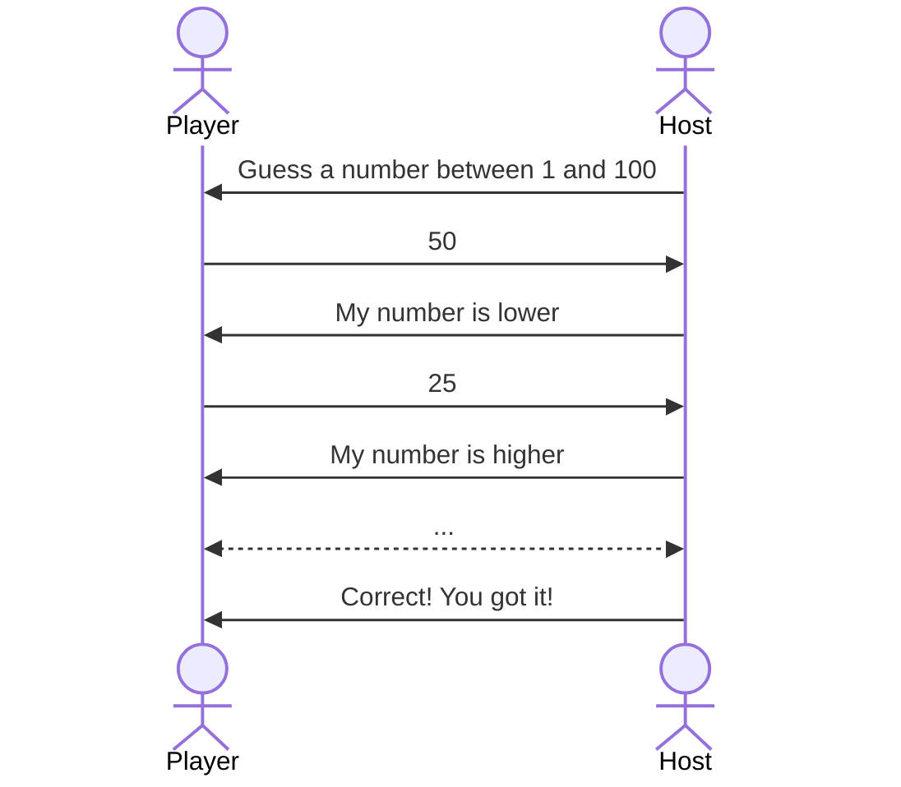
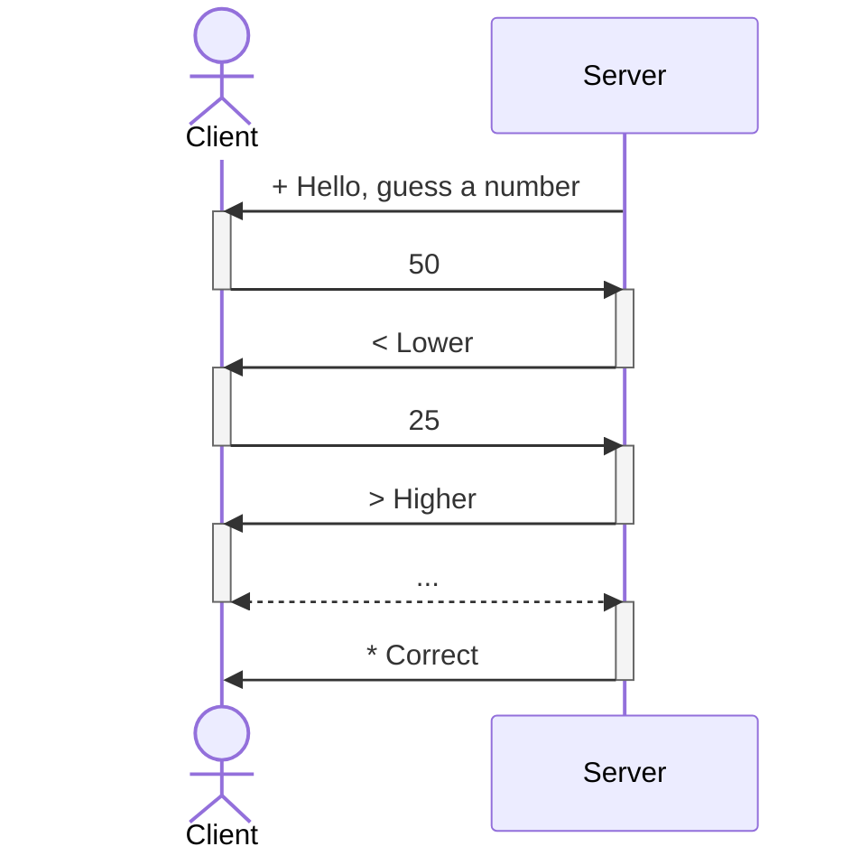
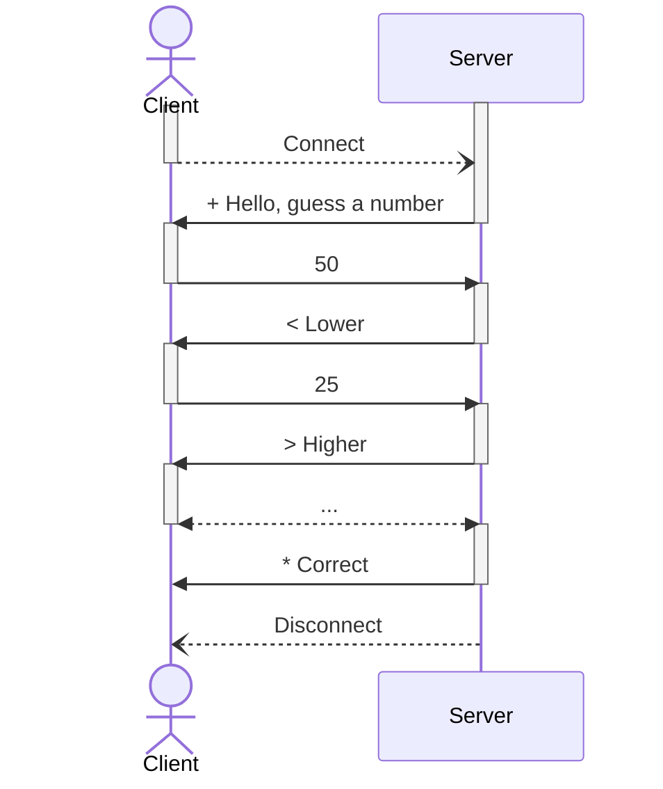
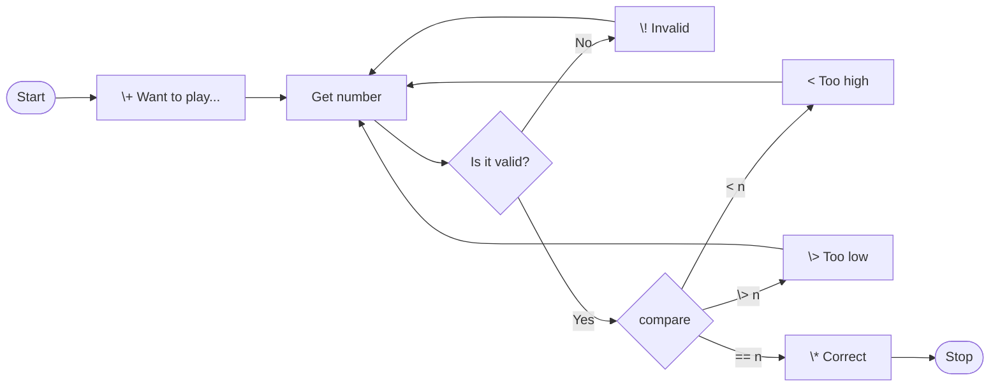

# Socket Programming for Network Communication

an introduction to network clients and servers
---
layout: side-title
---
:: title ::

## I've chosen a number<br/>between 1 and 100.

## Can you guess it?

:: content ::

# The Goal

Develop a network-based system that implements a number guessing game.

For starters, lets just focus on the **server** side of things. We can use the `telnet` program for our client, testing, and validation of our server.

## The Game

The game is to guess a number between 1 and 100. After a player connects, the server will silently choose a random number and give higher/lower hints to the player as they try to guess the chosen number. When they are successful, the game ends and the connection terminates.

---
layout: default
---

# With a Partner, Play a Few Rounds of the Guessing Game

<Question>

# Write down the sequence of play

- ## How do you start?
- ## What do you do if they give a bad response?
- ## How do you end?
</Question>

<CountdownTimer :minutes="7" :seconds="0" />

---
layout: two-cols-title
---

:: title ::

# The Guessing Game **Protocol v1**

:: left ::



:: right ::

**Player** and **Host** are the two actors in our game.


The game progresses through a formal set of exchanges:

1. The **Host** starts by asking the **Player** to guess a number.
2. The **Player** announces a number guess.
3. The **Host** tells them if the number is too high, too low, or the correct number

Steps 2-3 continue until the **Player** has guessed the correct number, the **Host** tells them it is correct and the game ends.

---
layout: two-cols-title
---

:: title ::

# The Guessing Game **Protocol v2**

:: left ::



:: right ::

**Client** and **Server** replace **Player** and **Host**.

The **first character** of each line the server sends distinguish the type of message.

- `+ ` indicates the start of the game
- `! ` indicates invalid number was received
- `* ` indicates the correct number was guessed
- `< ` indicates the guess was too high
- `> ` indicates the guess was too low

The **Client** only sends numbers.

---
layout: two-cols-title
---

:: title ::

# The Guessing Game **Protocol v3**

:: left ::



:: right ::

**Connect** and **Disconnect** are functions of network library shown for clarity.

Refining the details of the protocol, we see that

- The **Server** is passively waiting for connections from clients.
- The **Client** actively connects to a waiting server
- The **Server** sends the first message
- The **Server** disconnects after transmitting the guess was correct.

---
title: game code java
---

# Guessing Game Server (Java)

An excellent starting place for **Java** is the [Java Tutorial](https://docs.oracle.com/javase/tutorial). Which includes a lesson [All About Sockets](https://docs.oracle.com/javase/tutorial/networking/sockets/). This example is from that tutorial.

```java {all|2|3|4-7|10|11|12-13|11|all}{ lines: true }
try ( 
    ServerSocket serverSocket = new ServerSocket(portNumber);
    Socket clientSocket = serverSocket.accept();
    PrintWriter out =
        new PrintWriter(clientSocket.getOutputStream(), true);
    BufferedReader in = new BufferedReader(
        new InputStreamReader(clientSocket.getInputStream()));
) {
    ...            
    out.println("+ Hello, guess a number...");
    while ((inputLine = in.readLine()) != null) {
        outputLine = responseForGuess(inputLine);
        out.println(outputLine);
        ...
    }
```

<Note >

You will need to add a loop to continue accepting new connections (with `accept()`) after this one closes.
</Note>

---
title: game code python
---

# Guessing Game Server (Python)

An excellent starting place for **Python** is the [Python Documentation](https://docs.python.org/3.12/). The [Socket Programming HOWTO](https://docs.python.org/3.12/howto/sockets.html) is very good and walks through an object-oriented approach to socket programming in Python. This is a much simpler example.

```python {all|3|4|5-6|7|8-10|11-12|8|14|all}{ lines: true }
import socket

s = socket.socket(socket.AF_INET, socket.SOCK_STREAM)
s.bind(('localhost', 2222))
s.listen(10)
conn, addr = s.accept()
conn.send('hello'.encode('utf-8'))
while True:
    data = conn.recv(1024)
    line = data.decode('utf-8')
    response = response_for_guess(line)
    conn.send(response.encode('utf-8'))

s.close()
```

<Note >

You will need to add a loop to continue accepting new connections (with `accept()`) after this one closes.
</Note>

---
layout: center
title: server logic
---

# Guessing Game Flow

What does the server's **response for guess** do?



---
layout: two-cols-title
columns: is-3
---
:: title ::

# Guessing Game Server

:: left ::

**Requirements**

:: right ::

## The server **must**

- Accept network connections on a configurable port number (>1024)
- Send the `welcome` message at the start of the communication.
- Read a line of data (terminated by newline).
- If the input is not a number or not [1, 100], send the `invalid` message. Otherwise, send either the `higher`, `lower`, or `correct` message.
- Loop until a correct guess or the connection terminates.
- Accept new connections after one terminates.
- Choose a **new** random number for the next game.

---
layout: two-cols-title
columns: is-3
---

:: title ::

# Guessing Game Server

:: left ::

Requirements

**Non-Requirements**

:: right ::

## The server **must not**

- Accept guesses via the terminal or shell where it was started.

- Display a graphical interface. This is a **server**. Servers run in the background and have **no user interface**.

- Terminate unexpectedly on invalid input or sudden connection loss. It should be reasonably resillient.

## ==All player interaction is over the network==

- If you need diagnostics, you **may** print them to `stdout` of the server program.

---
layout: two-cols-title
columns: is-3
---

:: title ::

# Guessing Game Server

:: left ::

Requirements

Non-Requirements

**Your Code**

:: right ::

## The Programming Part

- Use any programming language you want; Java, Python, C, Go, Rust...

- Use the **socket** library, do not use a higher-level library.

- You should be using functions like `accept()`, `send()`, `receive()`, `read()`, `write()`.

- You only have to handle one connection (client) at a time.

- If you are able to handle multiple clients at once, you will be ready for Project 2. This typically requires multi-threading of some sort.

- ==Read the specification== included with the assignment. It provides all the details you need to be successful!

---
layout: two-cols-title
columns: is-3
title: game code other
---

:: title ::

# Guessing Game Server

:: left ::

Requirements

Non-Requirements

Your Code

**Other Langauges**

:: right ::

## Other Programming Languages

Most other modern and general purpose programming languages provide for **socket programming** in some way. If you use a different language, you will have to find your own introduction materials.

You should also be aware that, **I need to be able to compile and run your code**.

You should choose a language that is available on the CS Lab UNIX/Linux systems. That is where I will test your code.

Known working languages: ==Python==, ==Java==, ==Rust==, ==C/C++==. Talk to me if you are thinking of using something other than these.


---
layout: default
---

# Example Interaction with Game

We don't have a proper client program at this point and you don't have to write one for the assignment.

This example uses the `telnet` program as a client to connect to the server and play the game. You could use a program like `Putty` on Windows to do the same thing.

```sh {all|1|2|3|4|5-6|7-8|9-10|11-13|all}{ lines: true }
$ telnet localhost 2222
+ Hello. I’m thinking of a number between 1 and 100. Can you guess it?
50
< My number is lower.
25
> Higher.
Go go gadget guesser!
! Invalid input, please enter only numbers between 1 and 100.
35
> Higher.
42
* That’s it. Good job. It took you 3 guesses. Thanks for playing.
$
```

`telnet` is a simple text-based communication program that allows you to connect to a compatible server then send and receive text-based messages.


---
layout: intro
---

# Socket Programming for Network Communication

The End

